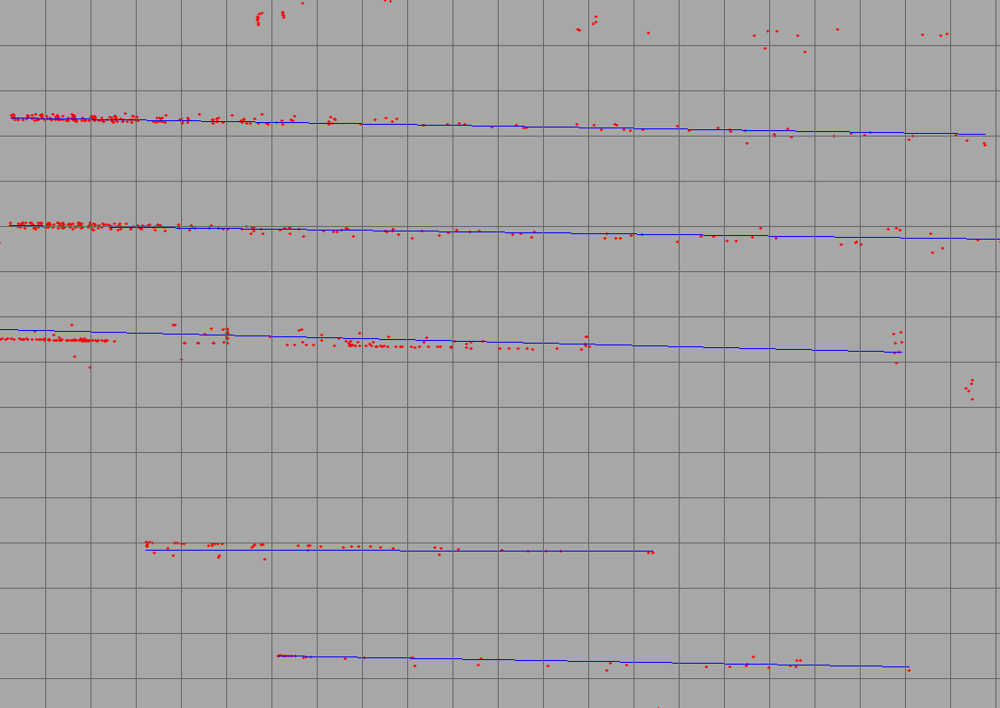

# 📝 gpu RANSAC fitting of 2D/3D multiple lines #
***

<p align="center">
  
</p>

## :tada: TODO
***

- [x] gpu multi-ransac fitting of multiple lines
- [x] test on 2d, 3d data

## 🎛  Dependencies
***

```bash
sudo apt-get install \
    libpcl-dev \
    libopencv-dev
```

- [CUDA toolkits](https://developer.nvidia.com/cuda-toolkit) (tested on cuda 10.2)

## 🔨 How to Build ##
***

```
make default # to build the library
make apps # to build the examples
```

## :running: How to Run ##
***

```bash
# test 2d data
./build/examples/2d_lines_fitting_app ./data/sample_2d.pcd

# test 3d data
./build/examples/3d_lines_fitting_app ./data/sample_3d.pcd
```

- Download [sample for 2d point-cloud data](https://drive.google.com/file/d/1t38ASRiZtij4WMVUhCqk6NH4mwL5Q2Dy/view?usp=sharing) for more tests on 2d data
